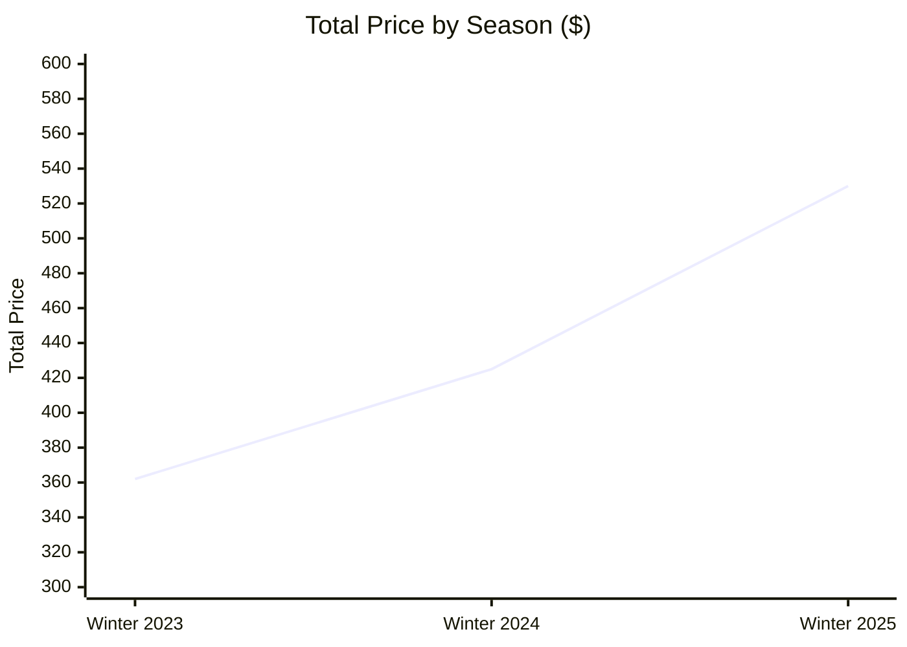
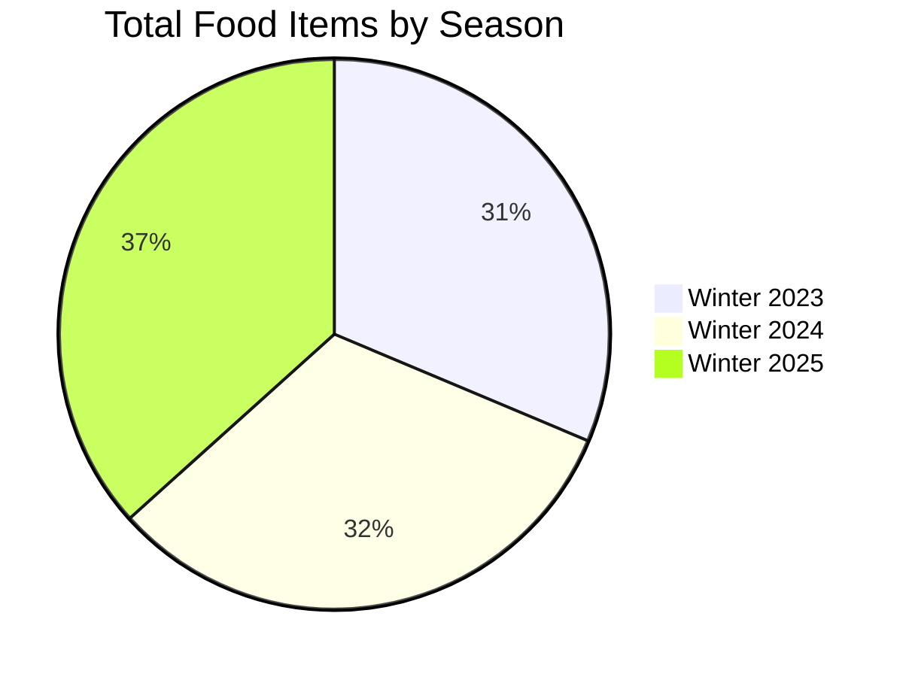

# 🍲 Winter Food and Beverages Report

### An interactive Excel dashboard on winter food and beverage performance

---

## 📑 Table of Contents

- [Project Overview](#-project-overview)
- [Data Source](#-data-source)
- [Tools Used](#-tools-used)
- [Workbook Structure](#-workbook-structure)
- [Key Metrics](#-key-metrics)
- [Dashboard Visuals](#-dashboard-visuals)
- [Insights](#-insights)
- [Recommendations](#-recommendations)
- [How to Use](#-how-to-use)
- [Author](#-author)

---

## 📌 Project Overview

This project summarises **150 winter food and beverage items** across **3 seasons** (Winter 2023, 2024 and 2025) and **10 countries**. It tracks item counts, total price, average price and popularity score to show which items, countries and seasons perform best.

## 🗂️ Data Source

The dataset comes from the [Maven Analytics Data Playground](https://www.mavenanalytics.io/data-playground).

## 🛠️ Tools Used

| Tool | Purpose |
|---|---|
| 📗 Microsoft Excel | Data cleaning and dashboard design |
| 📊 PivotTables and PivotCharts | Summaries and visuals |
| 🎛️ Slicers | Interactive filtering (Season, Type, Item) |

## 📁 Workbook Structure

| Sheet | Description |
|---|---|
| `Winter_Food_and_Beverages` | Raw data |
| `Pivot Table` | Pivot tables behind the charts |
| `Dashboard` | Final interactive dashboard |

## 🎯 Key Metrics

| 🧾 Total Items | 💰 Total Price | ⭐ Avg Popularity Score | 🏷️ Avg Price |
|:---:|:---:|:---:|:---:|
| **150** | **$1,318** | **5.3** | **$8.80** |

## 📊 Dashboard Visuals

| Visual | Chart Type |
|---|---|
| Total Food Items by Country | Bar chart |
| Total Price by Food Item | Bar chart |
| Total Price by Season | Line chart |
| Total Food Type by Country | Column chart |
| Total Food Items by Season | Doughnut chart |
| Average Popularity Score by Food Item | Column chart |

**Slicers:** Season, Type (Drink, Snack, Soup) and Item. They filter every chart at once.

### 📈 Total Price by Season

### 🥧 Items by Season

---

## 💡 Insights

| # | Insight |
|:---:|---|
| 1️⃣ | Revenue grew **46%** ($362 → $425 → $530), while item counts stayed flat (47, 48, 55). |
| 2️⃣ | **Soup ($166)** and **Latte ($164)** earn the most. **Chai ($82)** and **Green Tea ($93)** earn the least. |
| 3️⃣ | **Coffee** has the highest popularity score (**6.3**) but only mid-range revenue ($137). |
| 4️⃣ | **Japan (21)** and **Italy (19)** lead on item count. **Germany (11)** is lowest. |
| 5️⃣ | **Mulled Wine** has the lowest popularity score (**4.2**), against an overall average of 5.3. |

## ✅ Recommendations

| # | Recommendation |
|:---:|---|
| 1️⃣ | Find out whether price or product mix is driving the revenue growth. |
| 2️⃣ | Promote Soup and Latte, and bundle or reprice Chai and Green Tea. |
| 3️⃣ | Test a price increase or premium variant on Coffee. |
| 4️⃣ | Replicate the Japan and Italy range in Germany. |
| 5️⃣ | Rework or drop Mulled Wine to lift the average popularity score. |

---

## 🚀 How to Use

1. Open the workbook in Excel.
2. Go to the **Dashboard** sheet.
3. Click the **Season**, **Type** or **Item** slicers to filter the charts.
4. Click a selected slicer button again to clear the filter.

## 👤 Author

**Taiwo Ajiboye Muyideen**
📍 Lagos, Nigeria

⭐ If you found this project useful, give it a star!

